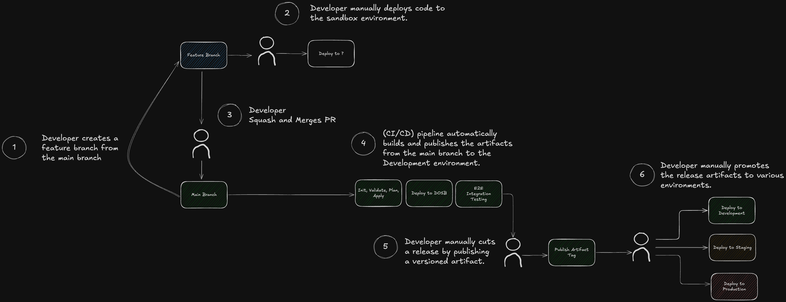

## Separate Configuration from the Code

- the config of the terraform is completely separate from the teraform code
  creating a clean yet strongly typed interface for the infrastructure
  module/service
- this reduces confusion about the source of input variables (eliminating
  harness-bootstrap) and makes reviewing the code much easier
- the config is located in a single place and is consumed by the code in a
  single place
- this sets us up to create an immutable artifact to be easily promoted across
  environments

## Create a Terraform Artifact

- we use a git tag to create a versioned artifact of the terraform
  configuration.

## Release Strategy

## Workflow with Secrets
- use decrypt-secrets.sh. It decrypts all secrets, allowing you to change the secret you need.
- after updating the secret, use encrypt-secrets.sh to encrypt it back.
- finally, commit and push the encrypted file.
